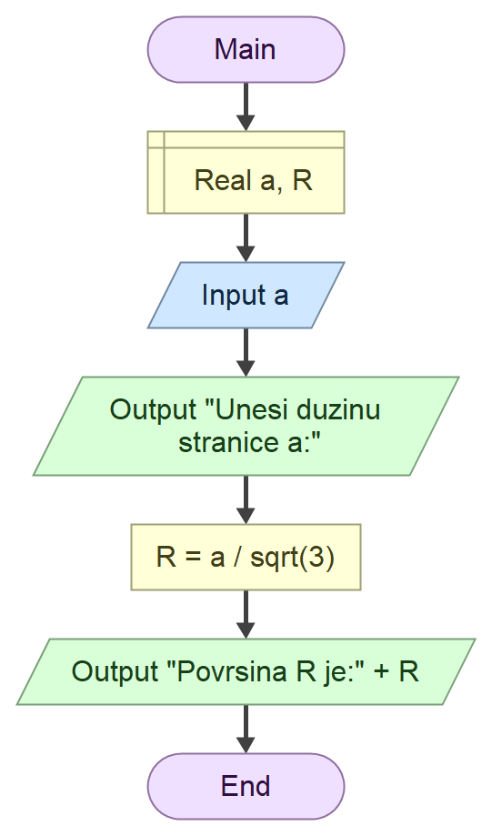

# Domaci zadatak Tehnicke dokumentacije

## Zadatak

Program koji na osnovu unete duzine *stranice* jednakostranicnog trougla a izracunava *poluprecnik opisane kruznice* R.

## Formula 

$$
R=\frac{a}{\sqrt{3}}
$$

### Algoritamska sema

## Resenje

""" cs
using System;

class Program
{
    static void Main()
    {
        double a, R;

        Console.Write("Unesi duzinu stranice a: ");
        a = double.Parse(Console.ReadLine());

        R = a / Math.Sqrt(3);

        Console.WriteLine("Poluprecnik opisane kruznice iznosi: " + R);
    }
}
"""

### Test primeri

Test primer 1:

""" text
Unesi duzinu stranice a: 16
Poluprecnik opisane kruznice iznosi: 9.23760430703401

C:\Users\ognje\source\repos\ConsoleApp2\ConsoleApp2\bin\Debug\ConsoleApp2.exe (process 20296) exited with code 0 (0x0).
To automatically close the console when debugging stops, enable Tools->Options->Debugging->Automatically close the console when debugging stops.
Press any key to close this window . . .
"""

Test primer 2:

""" text
Unesi duzinu stranice a: 28.4
Poluprecnik opisane kruznice iznosi: 16.3967476449854

C:\Users\ognje\source\repos\ConsoleApp2\ConsoleApp2\bin\Debug\ConsoleApp2.exe (process 12524) exited with code 0 (0x0).
To automatically close the console when debugging stops, enable Tools->Options->Debugging->Automatically close the console when debugging stops.
Press any key to close this window . . .
"""

### Objekti

| Redni broj | Naziv promenljive | Tip promenljive |
| -----------| ------------------| ----------------|
| 1.         | 'a'               |  'double'       |
| 2.         | 'R'               |  'double'       |

